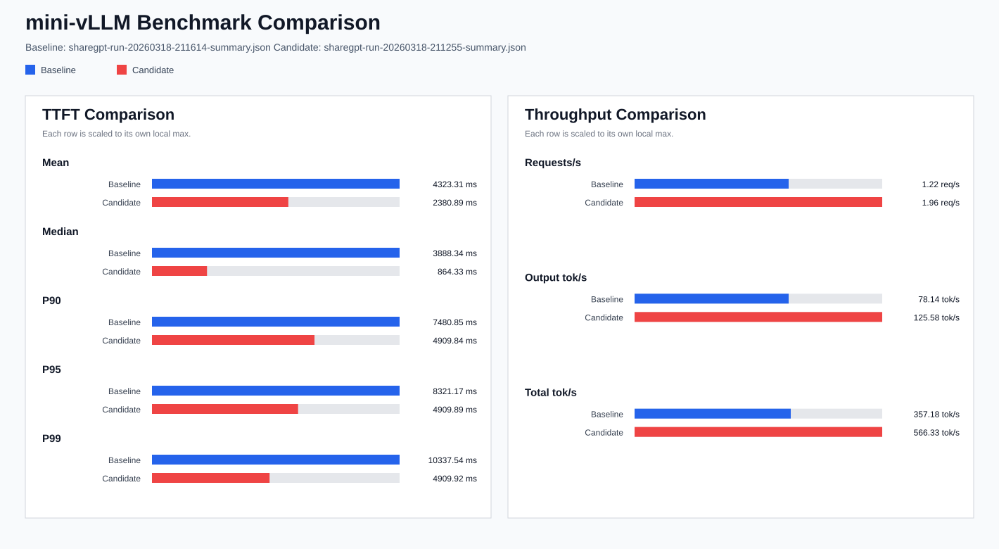
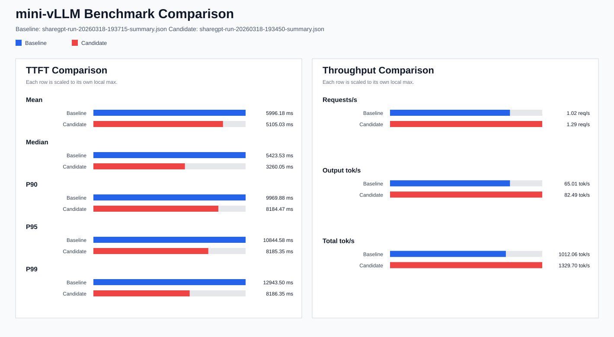

# mini-vllm

`mini-vllm` is a small, single-GPU inference project for learning and testing vLLM-style serving ideas with LitGPT-backed models. It focuses on the core moving parts of an LLM serving engine: request tracking, continuous batching, scheduling, KV-cache allocation, and model execution.

The project is especially useful for side-by-side comparison between:

- dense, per-sequence KV cache allocation (`standard`)
- shared block-pool paged attention (`paged`)

It also includes a ShareGPT-based benchmarking harness so the two backends can be evaluated on a more realistic prompt-length distribution instead of only toy prompts.

## Table of Contents

- [Why this project exists](#why-this-project-exists)
- [What it includes](#what-it-includes)
- [How it works](#how-it-works)
- [Dense vs paged attention comparison](#dense-vs-paged-attention-comparison)
- [ShareGPT benchmarking](#sharegpt-benchmarking)
- [Project structure](#project-structure)
- [Getting started](#getting-started)
- [Usage](#usage)
- [Benchmark results](#benchmark-results)
- [Related docs](#related-docs)

## Why this project exists

This repository is a compact playground for understanding the ideas behind vLLM without needing the full production codebase. It keeps the main serving loop readable while still covering the important system-level concepts:

- asynchronous request handling
- continuous batching
- scheduler-driven execution
- KV-cache sizing and allocation
- dense attention vs paged attention tradeoffs
- request-level inference benchmarking

## What it includes

- A minimal async inference engine in `src/engine`
- A scheduler and allocator layer for active request management
- A `ModelRunner` that executes LitGPT models and manages KV cache setup
- Two KV-cache backends:
  - `standard`: dense per-sequence cache
  - `paged`: shared block-based paged cache
- A benchmark harness in `src/eval_inference.py`
- ShareGPT workload sampling for realistic prompt-length benchmarking
- Comparison artifacts in `benchmark_results/`

## How it works

At a high level, the execution flow is:

1. requests are added to `AsyncEngine`
2. the scheduler selects runnable work for the next step
3. the model runner prepares inputs and attention metadata
4. the selected KV-cache backend executes the forward pass
5. sampled tokens are returned to the scheduler and request state is updated

The code is intentionally organized around the same core layers you would expect in a larger inference stack:

- `AsyncEngine`: top-level orchestration
- `Scheduler`: batching and step-level scheduling
- `Allocator`: dense-slot or paged-block ownership
- `ModelRunner`: model execution and KV-cache lifecycle
- `CacheManager`: backend-specific dense or paged attention behavior

## Dense vs paged attention comparison

One of the main goals of this project is to make dense KV cache allocation and paged attention easy to compare in the same codebase.

### `standard` backend

The `standard` backend pre-allocates a dense KV cache for each active sequence. This is simpler and easier to reason about, but memory is reserved per sequence even when prompts are short or sequence lengths vary.

### `paged` backend

The `paged` backend allocates a shared pool of fixed-size KV blocks and gives each request a block table that maps logical token positions to physical cache blocks. This makes it possible to:

- pack variable-length requests more efficiently
- reuse shared GPU blocks across active sequences
- study the same style of paged KV cache layout used by vLLM-like systems

Because both backends are available behind the same engine and benchmark harness, this repo supports true side-by-side experiments instead of separate one-off prototypes.

## ShareGPT benchmarking

The benchmark harness supports built-in prompts, prompt files, and sampled ShareGPT workloads. The ShareGPT path is useful because it produces a broader range of prompt lengths and more realistic request mixes than a short synthetic test set.

This project currently samples prompts from:

- dataset: `Aeala/ShareGPT_Vicuna_unfiltered`
- split: `train`

The harness can:

- sample ShareGPT conversations
- bucket by prompt length
- save the sampled prompts as JSONL
- run inference and record request-level traces
- emit summary JSON files
- compare two runs and render a graph

That makes it easy to benchmark dense vs paged attention on the same style of workload and keep the resulting artifacts under `benchmark_results/`.

## Benchmark results


The repository already includes a dense-vs-paged ShareGPT comparison, ran on a single RTX5090 node with 32gb VRAM

##### 16 prompts with mediam length 210 tokens (burst mode)

From the saved summaries:

| Metric | Dense (`standard`) | Paged (`paged`) | Direction |
|---|---:|---:|---|
| Completed requests | 16.00 | 16.00 | flat |
| Benchmark duration | 13.11 s | 8.15 s | paged better |
| Request throughput | 1.22 req/s | 1.96 req/s | paged better |
| Output throughput | 78.14 tok/s | 125.58 tok/s | paged better |
| Total token throughput | 357.18 tok/s | 566.33 tok/s | paged better |
| Mean TTFT | 4323.31 ms | 2380.89 ms | paged better |
| Median TTFT | 3888.34 ms | 864.33 ms | paged better |
| P90 TTFT | 7480.85 ms | 4909.84 ms | paged better |
| P95 TTFT | 8321.17 ms | 4909.89 ms | paged better |
| P99 TTFT | 10337.54 ms | 4909.92 ms | paged better |
| Mean TPOT | 50.98 ms | 57.62 ms | dense better |
| Median TPOT | 51.81 ms | 61.34 ms | dense better |
| Mean ITL | 50.98 ms | 57.62 ms | dense better |
| Median ITL | 51.52 ms | 52.25 ms | dense better |
| Mean E2EL | 7535.20 ms | 6011.24 ms | paged better |
| Median E2EL | 7152.39 ms | 4728.64 ms | paged better |
| P90 E2EL | 10782.09 ms | 8150.24 ms | paged better |
| P95 E2EL | 11361.99 ms | 8150.29 ms | paged better |
| P99 E2EL | 12753.33 ms | 8150.33 ms | paged better |
| Total engine steps | 256.00 | 128.00 | paged better |
| Mean unfinished reqs/step | 8.50 | 11.00 | dense better |
| Max unfinished reqs/step | 16.00 | 16.00 | flat |

##### 16 prompts with mediam length 920 tokens (burst mode)


From the saved summaries:

| Metric | Dense (`standard`) | Paged (`paged`) | Direction |
|---|---:|---:|---|
| Benchmark duration | 15.75 s | 11.80 s | paged better |
| Request throughput | 1.02 req/s | 1.36 req/s | paged better |
| Output throughput | 65.01 tok/s | 86.80 tok/s | paged better |
| Total token throughput | 1012.06 tok/s | 1358.17 tok/s | paged better |
| Mean TTFT | 5996.18 ms | 4591.34 ms | paged better |
| Median TTFT | 5423.53 ms | 2526.07 ms | paged better |
| Mean TPOT | 50.85 ms | 63.03 ms | dense better |

In this sample, paged attention improved overall throughput and time-to-first-token, while dense attention still had better per-output-token latency. That tradeoff is exactly the kind of behavior this project is designed to expose and study.

## Limitations & improvements

This project is intentionally small and not yet competitive with production serving stacks. The biggest current bottleneck is **prefill**.

- **Limitation: prefill dominates end-to-end latency**
  - Prefill runs full attention over the entire prompt and is a large fraction of total time (TTFT / E2EL), especially for longer prompts.
  - With many concurrent requests, long-prefill requests can reduce batching efficiency for decode steps.
- **Limitation: no chunked prefill**
  - Prefill is currently done as a single monolithic pass per request (no chunked/paged prefill), which makes it harder to overlap work and keep the GPU consistently utilized.

Planned improvements:

- **Chunked prefill**: split long prompts into smaller chunks so the engine can interleave prompt ingestion with decode steps and improve tail latency under mixed workloads.
- **Better prefill kernels / attention path**: use more optimized attention implementations for prompt ingestion (and/or reduce CPU-side overhead in metadata building).
- **Prefix / prompt caching**: reuse KV for repeated system prompts or shared prefixes to reduce repeated prefill work.
- **Smarter scheduling**: account for prefill cost explicitly (e.g., cap prefill tokens per step) to avoid one long prompt starving decode.

## Project structure

```text
mini-vllm/
|-- src/
|   |-- config/           # engine and KV-cache configuration
|   |-- engine/           # async engine, scheduler, allocator
|   |-- worker/           # model runner and cache managers
|   |-- scripts/          # runnable demos and tests
|   `-- eval_inference.py # benchmark harness and comparison tools
|-- docs/                 # architecture notes and KV-cache design docs
|-- benchmark_results/    # saved benchmark summaries, prompt files, graphs
`-- litgpt/               # vendored LitGPT dependency
```

## Getting started

### Prerequisites

- Python environment with CUDA-enabled PyTorch
- model checkpoint compatible with LitGPT
- enough GPU memory to load the model and reserve KV cache

### Install

```bash
pip install -r requirement.txt
```

You will download a Llama-3.1-8B checkpoint using litgpt cli:
```bash
litgpt serve meta-llama/Llama-3.1-8B
```

## Usage

### Run a simple generation demo

```bash
python -m src.scripts.run_generation --short
```

### Run the engine test script

```bash
python -m src.scripts.run_engine
```

### Run a basic benchmark

```bash
python -m src.eval_inference run
```

### Run a ShareGPT benchmark

Dense baseline:

```bash
python -m src.eval_inference sharegpt-run --kv-cache-manager standard --num-prompts 16 --max-num-seqs 5
```

Paged candidate:

```bash
python -m src.eval_inference sharegpt-run --kv-cache-manager paged --num-prompts 16 --max-num-seqs 10
```

### Compare two benchmark summaries

```bash
python -m src.eval_inference compare \
  benchmark_results/sharegpt-run-20260318-193715-summary.json \
  benchmark_results/sharegpt-run-20260318-193450-summary.json
```

### Render a comparison graph

```bash
python -m src.eval_inference graph \
  benchmark_results/sharegpt-run-20260318-193715-summary.json \
  benchmark_results/sharegpt-run-20260318-193450-summary.json
```
